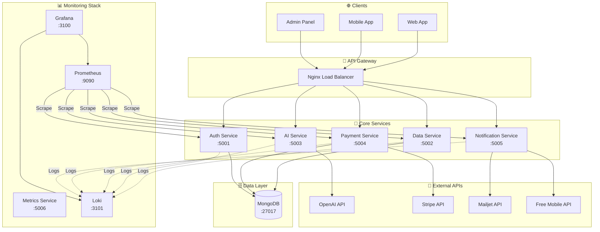

# 🗺️ RoadTrip! - Écosystème Microservices Intelligent

> **Plateforme complète de planification de voyages** avec intelligence artificielle, abonnements premium et monitoring avancé

[](https://nodejs.org/)
[](https://www.mongodb.com/)
[](https://docker.com/)
[](https://microservices.io/)

## 🎯 **Vue d'ensemble**

RoadTrip! est un écosystème microservices moderne pour la planification intelligente de voyages. Combinant IA générative, logique premium et monitoring professionnel, il offre une expérience utilisateur complète avec architecture scalable.

### **🚀 Fonctionnalités principales**
- 🤖 **IA générative** - Itinéraires personnalisés via OpenAI GPT-4o-mini
- 🔐 **Authentification complète** - OAuth 2.0 (Google/Facebook) + JWT
- 💰 **Abonnements premium** - Stripe avec logique de contenu intelligent
- 📧 **Notifications multi-canal** - Emails (Mailjet) + SMS (Free Mobile)
- 📊 **Monitoring enterprise** - Prometheus + Grafana + Loki
- 🛡️ **Sécurité production** - Rate limiting + validation + CORS

---

## 🏗️ **Architecture Microservices**



---

## 🚀 **Démarrage rapide**

### **Prérequis**
- Docker 20+ & Docker Compose
- Node.js 20+ (développement local)
- Comptes développeurs : OpenAI, Stripe, Mailjet

### **Installation complète**

```bash
# 1. Cloner le projet
git clone <repo-url>
cd roadtrip

# 2. Configuration environnement
cp .env.example .env
# ⚠️ OBLIGATOIRE: Configurer les clés API dans .env

# 3. Démarrage complet (Docker)
docker-compose up -d

# 4. Vérifier le statut
docker-compose ps
```

### **Variables d'environnement critiques**

```bash
# 🔥 OBLIGATOIRES
MONGODB_URI=mongodb://localhost:27017/roadtrip
JWT_SECRET=your-ultra-secure-jwt-secret-64-chars-minimum
JWT_REFRESH_SECRET=your-ultra-secure-refresh-secret-64-chars

# 🤖 Intelligence Artificielle
OPENAI_API_KEY=sk-your-openai-key-here

# 💳 Paiements Stripe
STRIPE_SECRET_KEY=sk_test_your-stripe-key
STRIPE_WEBHOOK_SECRET=whsec_your-webhook-secret
STRIPE_PRICE_MONTHLY_ID=price_monthly_id
STRIPE_PRICE_ANNUAL_ID=price_annual_id

# 📧 Notifications
MAILJET_API_KEY=your-mailjet-api-key
MAILJET_API_SECRET=your-mailjet-secret
FREE_MOBILE_USERNAME=your-free-mobile-user
FREE_MOBILE_API_KEY=your-free-mobile-key

# 🔐 OAuth
GOOGLE_CLIENT_ID=your-google-client-id
GOOGLE_CLIENT_SECRET=your-google-secret
FACEBOOK_CLIENT_ID=your-facebook-app-id
FACEBOOK_CLIENT_SECRET=your-facebook-secret

# 🔗 URLs
FRONTEND_URL=http://localhost:3000
```

### **Accès aux services**

Une fois démarré, les services sont disponibles sur :

| Service | URL | Description |
|---------|-----|-------------|
| 🌐 **Frontend** | http://localhost:3000 | Interface utilisateur React |
| 🔐 **Auth** | http://localhost:5001 | Authentification OAuth + JWT |
| 💾 **Data** | http://localhost:5002 | API centrale + Admin panel |
| 🤖 **AI** | http://localhost:5003 | Génération d'itinéraires IA |
| 💳 **Payment** | http://localhost:5004 | Abonnements Stripe |
| 📧 **Notification** | http://localhost:5005 | Emails + SMS |
| 📊 **Metrics** | http://localhost:5006 | API métriques |
| 📈 **Grafana** | http://localhost:3100 | Dashboards (admin/admin123) |
| 🔍 **Prometheus** | http://localhost:9090 | Métriques brutes |

---

## 🏢 **Services Détaillés**

### **🔐 Auth Service** - *Authentification sécurisée*
- **OAuth 2.0** complet (Google, Facebook)
- **JWT multi-source** (Header, Cookie, Query)
- **Sessions sécurisées** avec fallback MongoDB
- **Rate limiting** différencié par endpoint

**📖 [Documentation complète](./auth-service/README.md)**

### **💾 Data Service** - *Hub central intelligent*
- **API Gateway** pour tous les microservices
- **Logique premium** avec content gating automatique
- **Admin panel RGPD** avec dashboard professionnel
- **Authentification multi-source** et gestion des rôles

**📖 [Documentation complète](./data-service/README.md)**

### **🤖 AI Service** - *Intelligence artificielle*
- **OpenAI GPT-4o-mini** pour génération d'itinéraires
- **Cache intelligent** avec optimisation des performances
- **Intégration météo** Open-Meteo temps réel
- **Fallback robuste** en cas d'indisponibilité

**📖 [Documentation complète](./ai-service/README.md)**

### **💳 Payment Service** - *Abonnements premium*
- **Stripe intégration** complète (Checkout + Webhooks)
- **Plans flexibles** (mensuel 5€, annuel 45€)
- **Gestion cycle de vie** (upgrade, cancel, refund)
- **Proratisation automatique** des changements de plan

**📖 [Documentation complète](./paiement-service/README.md)**

### **📧 Notification Service** - *Communications multi-canal*
- **Emails transactionnels** via Mailjet avec templates
- **SMS sécurisés** via Free Mobile API
- **Mode simulation** pour développement sans config
- **Templates responsives** avec branding cohérent

**📖 [Documentation complète](./notification-service/README.md)**

### **📊 Metrics Service** - *Monitoring enterprise*
- **Prometheus** pour collecte métriques temps réel
- **Grafana** dashboards professionnels pré-configurés
- **Loki** pour logs centralisés multi-services
- **Alertes intelligentes** avec intégrations Slack

**📖 [Documentation complète](./metrics-service/README.md)**

---

## 💰 **Logique Métier Premium**

### **Modèle économique**
- **Freemium** : Accès gratuit avec contenu limité
- **Premium Monthly** : 5€/mois - Accès complet
- **Premium Annual** : 45€/an - Économie de 25%

### **Content Gating intelligent**
```javascript
// Logique automatique côté API
if (trip.isPremium && userRole !== 'premium') {
  tripData.itinerary = truncateContent(tripData.itinerary);
  tripData.premiumNotice = {
    message: "Contenu réservé aux utilisateurs premium",
    callToAction: "S'abonner pour débloquer",
    missingFeatures: ["Itinéraire complet", "Carte interactive", "IA avancée"]
  };
}
```

### **Fonctionnalités premium**
- ✅ **Itinéraires illimités** générés par IA
- ✅ **Recommandations avancées** personnalisées
- ✅ **Cartes interactives** détaillées
- ✅ **Export PDF** des itinéraires
- ✅ **Support prioritaire** via chat

---

## 🛡️ **Sécurité Enterprise**

### **Authentification multicouches**
- **JWT** : Access (1h) + Refresh (7d) tokens
- **OAuth 2.0** : Google + Facebook avec OpenID Connect
- **Sessions** : HttpOnly + Secure + SameSite
- **Rate limiting** : Différencié par endpoint et utilisateur

### **Protection des données**
- **RGPD compliant** : Suppression cascade complète
- **Validation stricte** : Express-validator sur tous endpoints
- **Headers sécurisés** : Helmet.js + CSP custom
- **Chiffrement** : bcrypt + salt pour passwords

### **Monitoring sécurité**
```bash
# Métriques de sécurité Prometheus
auth_service_oauth_attempts_total{provider="google",success="false"}
data_service_premium_content_access_total{user_role="user",blocked="true"}
notification_service_email_sent_total{type="security_alert"}
```

---

## 📊 **Monitoring & Observabilité**

### **Stack de monitoring professionnel**
- **Prometheus** : Collecte métriques (15s interval)
- **Grafana** : 8 dashboards pré-configurés
- **Loki** : Logs centralisés JSON structurés
- **Promtail** : Agent collecte multi-services

### **Dashboards Grafana inclus**
1. **🌐 Services Overview** - Vue globale santé
2. **👥 User Analytics** - Inscriptions, authentifications
3. **💰 Payment Analytics** - Conversions, abonnements
4. **🤖 AI Performance** - Génération itinéraires, cache
5. **📧 Communications** - Emails/SMS envoyés
6. **🔒 Security Dashboard** - Tentatives suspectes
7. **⚡ Performance** - Temps de réponse, throughput
8. **🏗️ Infrastructure** - CPU, RAM, connexions DB

### **Métriques business critiques**
```bash
# Performance
roadtrip_http_request_duration_seconds{service="ai-service",route="/api/ai/ask"}

# Business
roadtrip_user_registrations_total{source="oauth"}
roadtrip_premium_subscriptions_total{plan="monthly"}
roadtrip_ai_itineraries_generated_total

# Santé services
roadtrip_service_health{service_name="data-service",status="healthy"}
```

---

## 🧪 **Tests & Qualité**

### **Suite de tests complète**
```bash
# Tests tous services
npm run test:all

# Tests avec coverage
npm run test:coverage

# Tests integration
npm run test:integration

# Tests end-to-end
npm run test:e2e
```

### **Coverage objectifs**
- **Auth Service** : >90% (sécurité critique)
- **Data Service** : >85% (logique métier)
- **AI Service** : >80% (intégrations externes)
- **Payment Service** : >95% (transactions critiques)
- **Notification Service** : >80% (communications)

### **Tests automatisés**
- ✅ **Unit tests** : Jest pour chaque service
- ✅ **Integration tests** : APIs inter-services
- ✅ **Security tests** : Validation endpoints
- ✅ **Performance tests** : Load testing avec Artillery
- ✅ **E2E tests** : Playwright pour parcours utilisateur

---

## 🐳 **Déploiement Production**

### **Docker optimisé**
```bash
# Build production
docker-compose -f docker-compose.prod.yml build

# Déploiement avec secrets
docker-compose -f docker-compose.prod.yml up -d
```

### **Configuration production**
```bash
# Variables critiques production
NODE_ENV=production
JWT_SECRET=crypto-strong-64-chars-minimum
MONGODB_URI=mongodb+srv://cluster.mongodb.net/roadtrip
CORS_ORIGIN=https://roadtrip.app
RATE_LIMIT_ENABLED=true

# SSL/TLS obligatoire
FORCE_HTTPS=true
SECURE_COOKIES=true
```

### **Checklist déploiement**
- ✅ **Secrets** : Variables env chiffrées
- ✅ **SSL/TLS** : Certificats valides
- ✅ **Base données** : MongoDB Atlas ou équivalent
- ✅ **Monitoring** : Alertes configurées
- ✅ **Backup** : Sauvegarde automatique
- ✅ **CDN** : Assets statiques optimisés

---

## 🚨 **Troubleshooting**

### **Problèmes courants**

| Problème | Cause | Solution |
|----------|-------|----------|
| `❌ Services ne démarrent pas` | Docker/variables env | Vérifier `docker-compose ps` et `.env` |
| `🔐 JWT invalide` | Secret différent entre services | Unifier `JWT_SECRET` dans tous services |
| `💾 MongoDB connection failed` | Base non accessible | Vérifier `MONGODB_URI` et réseau Docker |
| `🤖 OpenAI timeout` | Clé API ou quota | Vérifier `OPENAI_API_KEY` et billing |
| `📧 Emails non envoyés` | Config Mailjet | Tester `MAILJET_API_KEY` et domaine |

### **Commandes de diagnostic**

```bash
# Status global
docker-compose ps

# Logs en temps réel
docker-compose logs -f [service-name]

# Health checks
curl http://localhost:5002/health  # Data Service
curl http://localhost:5001/health  # Auth Service

# Test connectivité MongoDB
docker exec -it mongodb mongosh

# Métriques Prometheus
curl http://localhost:9090/api/v1/targets

# Dashboard Grafana
open http://localhost:3100
```

### **Reset complet**
```bash
# Arrêt et nettoyage
docker-compose down -v

# Suppression images
docker-compose down --rmi all

# Redémarrage propre
docker-compose up -d --build
```

---

## 🔧 **Développement Local**

### **Setup développeur**
```bash
# Installation globale
npm install -g nodemon concurrently

# Développement service spécifique
cd ai-service
npm run dev

# Développement multiple services
npm run dev:all
```

### **Hot reload activé**
- **Nodemon** pour auto-restart
- **Volumes Docker** pour sync code
- **Logs temps réel** dans terminaux séparés

### **Base de données locale**
```bash
# MongoDB local
brew install mongodb/brew/mongodb-community
brew services start mongodb-community

# MongoDB Compass (GUI)
open mongodb://localhost:27017
```

---

## 🤝 **Contribution**

### **Standards de développement**
- 🔐 **Security-first** : Validation + sanitization obligatoires
- 🧪 **Tests** : Coverage minimal requis par service
- 📊 **Logs** : Structured logging avec contexte métier
- 🔗 **Integration** : Health checks pour services externes
- 📝 **Documentation** : README détaillé par modification

### **Workflow Git**
```bash
# 1. Fork et clone
git clone https://github.com/your-username/roadtrip.git

# 2. Branch feature
git checkout -b feature/nouvelle-fonctionnalite

# 3. Développement + tests
npm test

# 4. Commit descriptif
git commit -m "feat(ai-service): amélioration génération itinéraires"

# 5. Push et Pull Request
git push origin feature/nouvelle-fonctionnalite
```

### **Convention commits**
- `feat:` - Nouvelle fonctionnalité
- `fix:` - Correction de bug
- `perf:` - Amélioration de performance
- `security:` - Correction de sécurité
- `docs:` - Documentation uniquement

---

## 📚 **Documentation Technique**

### **APIs & Spécifications**
- 🔗 **OpenAPI 3.0** : Specs disponibles sur `/api-docs`
- 📊 **Prometheus** : [Métriques customs](http://localhost:9090/graph)
- 🔐 **JWT** : [RFC 7519](https://tools.ietf.org/html/rfc7519)
- 💳 **Stripe** : [Webhooks guide](https://stripe.com/docs/webhooks)

### **Architecture & Patterns**
- 🏗️ **Microservices** : [Patterns & Best Practices](https://microservices.io/)
- 🔄 **Event-driven** : Webhooks + Message queues
- 🛡️ **Security** : [OWASP Top 10](https://owasp.org/www-project-top-ten/)
- 📊 **Monitoring** : [SRE Handbook](https://sre.google/sre-book/)

### **Technologies Stack**
- **Backend** : Node.js 20, Express.js, MongoDB
- **IA** : OpenAI GPT-4o-mini, Open-Meteo
- **Paiements** : Stripe Checkout + Webhooks
- **Auth** : OAuth 2.0, OpenID Connect, JWT
- **Monitoring** : Prometheus, Grafana, Loki
- **DevOps** : Docker, Docker Compose

---

## 📊 **Métriques Performance**

### **SLA Objectifs**
- **Disponibilité** : 99.9% (8h40 downtime/an max)
- **Temps de réponse** : <500ms (95e percentile)
- **Throughput** : >1000 req/min par service
- **Recovery Time** : <5 minutes après incident

### **Monitoring automatique**
- **Health checks** : Toutes les 30s
- **Alertes Slack** : Incidents critiques
- **Logs centralisés** : Retention 30 jours
- **Métriques temps réel** : Dashboard live

---

## 📄 **Licence & Certifications**

**ISC License** - Projet étudiant M2 Expert en Développement Logiciel

### **Conformité**
- ✅ **RGPD** : Gestion données personnelles
- ✅ **OAuth 2.0** : RFC 6749 compliant
- ✅ **OpenID Connect** : Validation tokens
- ✅ **PCI DSS** : Paiements sécurisés via Stripe

---

## 👤 **Auteur**

**Inès GERVAIS** - Expert en Développement Logiciel  
🎓 YNOV Campus - Promotion 2025  
📧 Contact : [ines.gervais@ynov.com](mailto:ines.gervais@ynov.com)

---

## 🎯 **Objectifs Pédagogiques**

*Ce projet RoadTrip! démontre la maîtrise complète de l'architecture microservices moderne dans le cadre de la certification **RNCP39583 - Expert en Développement Logiciel***

### **Compétences validées**
- 🏗️ **Architecture microservices** scalable et résiliente
- 🔐 **Sécurité enterprise** (OAuth, JWT, validation)
- 🤖 **Intégration IA** générative (OpenAI)
- 💳 **Fintech** (Stripe, abonnements, webhooks)
- 📊 **Monitoring professionnel** (Prometheus, Grafana)
- 🐳 **DevOps moderne** (Docker, CI/CD)
- 🧪 **Qualité logicielle** (tests, coverage, sécurité)

---

*🗺️ **RoadTrip! - Where Intelligence Meets Adventure** - Écosystème microservices pour la planification de voyages nouvelle génération.*