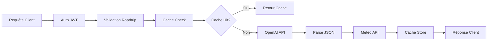

# 🤖 AI Service - ROADTRIP MVP

> **Microservice d'Intelligence Artificielle pour la génération d'itinéraires de roadtrip personnalisés**  
> *Projet M2 - MVP Microservices - Certification RNCP39583*

## 📋 Vue d'ensemble

Service Node.js intégrant **OpenAI GPT-4o-mini** pour générer des itinéraires de roadtrip personnalisés avec météo temps réel, cache intelligent et monitoring Prometheus.

### 🎯 Fonctionnalités MVP

- ✅ **Génération IA** : Itinéraires roadtrip via OpenAI GPT-4o-mini
- ✅ **Cache Intelligent** : NodeCache avec TTL pour optimiser les performances
- ✅ **Météo Temps Réel** : Intégration Open-Meteo API
- ✅ **Authentification JWT** : Accès réservé utilisateurs premium
- ✅ **Gestion Conversations** : Historique et sauvegarde des échanges
- ✅ **Monitoring Prometheus** : Métriques métier et techniques
- ✅ **Fallback Robuste** : Mode dégradé si OpenAI indisponible

---

## 🚀 Installation & Démarrage

### Prérequis
```bash
Node.js 20+
npm ou yarn
Clé API OpenAI
```

### Configuration
```bash
# Cloner et installer
git clone <repo>
cd ai-service
npm install

# Configurer l'environnement
cp .env.example .env
```

### Variables d'environnement
```env
SERVICE_NAME=ai-service
PORT=5003
NODE_ENV=development
LOG_LEVEL=debug
ENABLE_FILE_LOGGING=true
OPENAI_API_KEY=sk-your-openai-key
JWT_SECRET=your-jwt-secret
DATA_SERVICE_URL=http://localhost:5002
```

### Lancement
```bash
# Développement
npm run dev

# Production
npm start

# Tests avec coverage
npm test
```

---

## 📡 API Endpoints

### 🤖 Intelligence Artificielle
```http
POST /api/ai/ask
Authorization: Bearer <jwt_token>
Role: premium|admin

{
  "prompt": "Roadtrip Provence 7 jours",
  "duration": 7,
  "budget": "1500€"
}
```

**Réponse :**
```json
{
  "type": "roadtrip_itinerary",
  "destination": "Provence, France",
  "duree_recommandee": "7 jours",
  "budget_estime": {
    "total": "1200€",
    "transport": "300€",
    "hebergement": "500€",
    "nourriture": "250€",
    "activites": "150€"
  },
  "itineraire": [
    {
      "jour": 1,
      "lieu": "Marseille",
      "description": "Découverte du Vieux-Port",
      "activites": ["Calanques", "Notre-Dame de la Garde"],
      "distance": "0 km",
      "temps_conduite": "0h",
      "hebergement": "Hôtel centre-ville",
      "meteo": "18°C – 24°C, précipitations: 0 mm"
    }
  ],
  "conseils": ["Réservez les calanques à l'avance"]
}
```

### 💬 Gestion Conversations
```http
# Sauvegarder un message
POST /api/ai/save
{
  "role": "user|assistant",
  "content": "Contenu du message",
  "conversationId": "conv_123"
}

# Récupérer l'historique
GET /api/ai/history

# Supprimer l'historique complet
DELETE /api/ai/history

# Récupérer une conversation
GET /api/ai/conversation/:id

# Supprimer une conversation
DELETE /api/ai/conversation/:id
```

### 🔧 Système & Monitoring
```http
GET /health          # État du service
GET /metrics         # Métriques Prometheus
GET /vitals          # Statistiques système
GET /ping            # Test connectivité
```

---

## 🏗️ Architecture

### Structure Projet
```
ai-service/
├── controllers/         # Logique métier
│   └── aiController.js
├── services/           # Services externes
│   ├── aiService.js    # Cœur génération IA
│   └── dataService.js  # Communication data-service
├── middlewares/        # Middlewares Express
│   ├── authMiddleware.js
│   ├── errorHandler.js
│   └── metricsLogger.js
├── routes/            # Définition routes
│   ├── aiRoutes.js
│   └── systemRoutes.js
├── utils/             # Utilitaires
│   ├── logger.js
│   ├── roadtripValidation.js
│   ├── durationExtractor.js
│   └── cacheKey.js
├── config/            # Configuration
│   └── jwtConfig.js
├── test/              # Tests unitaires
│   └── ai.test.js
├── metrics.js         # Métriques Prometheus
└── server.js          # Point d'entrée
```

### Flow de Traitement


---

## 🔒 Sécurité & Authentification

### Authentification JWT
- **Token requis** : Header `Authorization: Bearer <token>`
- **Rôles supportés** : `premium`, `admin`
- **Expiration** : 1h (configurable)
- **Validation** : Signature + rôle + expiration

### Sécurité OWASP
```javascript
// Validation entrées
const validatePrompt = (prompt) => {
  return validator.escape(prompt.trim());
};

// Logs sécurité
logger.security('IA generation attempt', {
  userId: req.user.id,
  timestamp: new Date(),
  success: true
});
```

---

## 📊 Monitoring & Métriques

### Métriques Prometheus
- **Performance** : `ai_service_generation_duration_seconds`
- **Cache** : `ai_service_cache_hit_ratio`
- **Santé** : `ai_service_openai_health`
- **HTTP** : `ai_service_http_requests_total`

### Health Checks
```bash
curl http://localhost:5003/health
# {
#   "status": "healthy",
#   "timestamp": "2024-01-15T10:30:00.000Z",
#   "service": "ai-service"
# }
```

---

## 🧪 Tests & Qualité

### Coverage Cible MVP
```bash
npm test
# ✅ Controllers (85% coverage)
# ✅ Services IA (82% coverage) 
# ✅ Cache Logic (90% coverage)
# ✅ Authentication (95% coverage)
# ✅ Error Handling (88% coverage)
```

### Tests Critiques
- **Génération IA** : Validation responses + fallback
- **Cache** : Hit/miss scenarios + invalidation
- **Sécurité** : JWT validation + role-based access
- **Erreurs** : Gestion timeout + API failures

---

## 🐳 Déploiement Docker

```dockerfile
FROM node:20-alpine
WORKDIR /app
COPY package*.json ./
RUN npm install
COPY . .
EXPOSE 5003 9003
CMD ["npm", "run", "dev"]
```

---

## 🔍 Validation RNCP39583

### Critères Respectés

| Critère RNCP | Implémentation | Status |
|--------------|----------------|---------|
| **C2.2.1 - Prototype** | API REST + interface mobile | ✅ |
| **C2.2.2 - Tests Unitaires** | Jest + 85% coverage | ✅ |
| **C2.2.3 - Sécurité** | JWT + OWASP + logs | ✅ |
| **C4.1.2 - Supervision** | Prometheus + alertes | ✅ |
| **C4.2.1 - Anomalies** | Logs structurés JSON | ✅ |
| **C4.3.2 - Versions** | CHANGELOG automatisé | ✅ |

---

## 📈 Optimisations & Limitations MVP

### ✅ Optimisations Implémentées
- **Cache intelligent** : TTL 1h pour réduire coûts OpenAI
- **Fallback mode** : Continuité service si OpenAI down
- **Rate limiting** : Protection contre abus
- **Météo temps réel** : Enrichissement automatique
- **Logs structurés** : Observabilité production

### ⚠️ Limitations MVP
- **Durée max** : 15 jours (contrainte OpenAI tokens)
- **Validation prompt** : Uniquement roadtrip-related
- **Cache simple** : NodeCache en mémoire (pas Redis)
- **Météo basique** : Open-Meteo gratuit (7 jours max)

---

## 🚧 Roadmap Post-MVP

### Phase 2 (Production)
- [ ] **Cache Redis** : Cache distribué
- [ ] **Circuit Breaker** : Resilience patterns
- [ ] **Rate Limiting** : Redis-based avec quotas
- [ ] **Monitoring Avancé** : Grafana dashboards
- [ ] **Tests E2E** : Cypress ou Playwright

### Phase 3 (Scale)
- [ ] **Multi-providers IA** : Anthropic Claude, Gemini
- [ ] **Streaming responses** : Server-Sent Events
- [ ] **ML Recommendations** : Algorithmes de recommandation
- [ ] **A/B Testing** : Optimisation prompts IA

---

## 🐛 Troubleshooting

### Erreurs Courantes
```bash
# OpenAI API Key manquante
Error: OPENAI_API_KEY manquante!
# Solution: Configurer .env

# Service data-service indisponible  
Error: ECONNREFUSED localhost:5002
# Solution: Vérifier data-service démarré

# JWT invalide
Error: Token invalide
# Solution: Vérifier JWT_SECRET cohérent
```

---

## 👥 Contexte Projet

**Projet M2** - Développement d'un MVP microservices pour plateforme de roadtrip  
**Certification** : RNCP39583 - Expert en Développement Logiciel  
**Technologies** : Node.js, OpenAI GPT-4o-mini, Prometheus, JWT  
**Auteur** : Inès GERVAIS

---

## 📄 Licence

MIT License - Projet académique M2