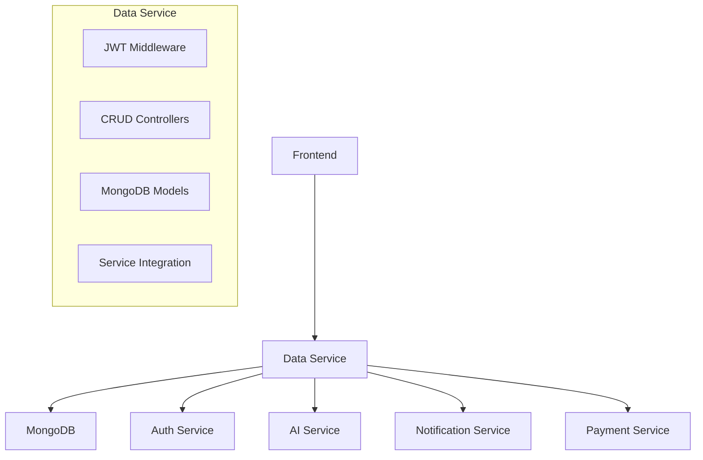

# 💾 Data Service - ROADTRIP MVP

> **Microservice de Persistance et CRUD sécurisé pour l'écosystème ROADTRIP**  
> *Projet M2 - MVP Microservices - Certification RNCP39583*

## 📋 Vue d'ensemble

Service Node.js centralisant la **persistance MongoDB**, authentification JWT, gestion utilisateurs, roadtrips, favoris et intégration avec les services IA, auth et notification.

### 🎯 Fonctionnalités MVP

- ✅ **MongoDB Persistence** : Gestion complète CRUD avec Mongoose
- ✅ **Authentification JWT** : Validation tokens + middleware sécurisé
- ✅ **Gestion Utilisateurs** : Profils, rôles, vérification email/SMS
- ✅ **Roadtrips CRUD** : Création, publication, contenu premium
- ✅ **Système Favoris** : Sauvegarde préférences utilisateur
- ✅ **Admin Dashboard** : Panel administration complet
- ✅ **Intégrations Services** : Communication avec AI, Auth, Notification

---

## 🚀 Installation & Démarrage

### Prérequis
```bash
Node.js 20+
npm ou yarn
MongoDB 6.0+
Services externes : AI, Auth, Notification
```

### Configuration
```bash
# Cloner et installer
git clone <repo>
cd data-service
npm install

# Configurer l'environnement
cp .env.example .env
```

### Variables d'environnement
```env
# Service Configuration
NODE_ENV=development
SERVICE_NAME=data-service
PORT=5002
SERVER_TIMEOUT=60000
MAX_REQUEST_BODY_SIZE=1mb

# MongoDB (OBLIGATOIRE)
MONGODB_URI=mongodb://localhost:27017/roadtrip

# JWT Security (OBLIGATOIRE)
JWT_SECRET=your-super-secure-secret-64-characters
JWT_REFRESH_SECRET=your-refresh-secret-64-characters

# CORS
CORS_ORIGIN=http://localhost:3000

# Services Integration
NOTIFICATION_SERVICE_URL=http://localhost:5005
AI_SERVICE_URL=http://localhost:5003
AUTH_SERVICE_URL=http://localhost:5001

# Free Mobile SMS (optionnel)
FREE_MOBILE_USERNAME=your-username
FREE_MOBILE_API_KEY=your-api-key

# Logs
LOG_LEVEL=info
ENABLE_FILE_LOGGING=true
```

### Lancement
```bash
# Développement
npm run dev

# Production
npm start

# Tests avec coverage
npm test
```

---

## 📡 API Endpoints

### 👤 Gestion Utilisateurs

#### Inscription
```http
POST /api/auth/register
Content-Type: application/json

{
  "email": "user@example.com",
  "password": "SecurePass123!",
  "firstName": "John",
  "lastName": "Doe"
}
```

#### Connexion
```http
POST /api/auth/login
Content-Type: application/json

{
  "email": "user@example.com",
  "password": "SecurePass123!"
}
```

**Réponse Authentification :**
```json
{
  "message": "Connexion réussie",
  "user": {
    "id": "507f1f77bcf86cd799439011",
    "email": "user@example.com",
    "firstName": "John",
    "lastName": "Doe",
    "role": "user"
  },
  "tokens": {
    "accessToken": "eyJhbGciOiJIUzI1NiIsInR5cCI6IkpXVCJ9...",
    "refreshToken": "eyJhbGciOiJIUzI1NiIsInR5cCI6IkpXVCJ9..."
  }
}
```

### 🗺️ Gestion Roadtrips

#### Récupérer roadtrips publics
```http
GET /api/roadtrips?page=1&limit=10&country=France&isPremium=false
```

#### Récupérer roadtrip par ID
```http
GET /api/roadtrips/:id
Authorization: Bearer <access_token>
```

**Réponse Roadtrip (Premium) :**
```json
{
  "success": true,
  "data": {
    "_id": "507f1f77bcf86cd799439011",
    "title": "Roadtrip Provence 7 jours",
    "description": "Découverte des villages perchés",
    "country": "France",
    "duration": 7,
    "budget": {
      "currency": "EUR",
      "amount": 1200
    },
    "isPremium": true,
    "isPublished": true,
    "pointsOfInterest": [
      {
        "name": "Gordes",
        "description": "Village perché classé plus beaux villages de France",
        "image": "/images/gordes.jpg"
      }
    ],
    "itinerary": [
      {
        "day": 1,
        "title": "Arrivée Marseille",
        "description": "Découverte du Vieux-Port et des Calanques",
        "overnight": true
      }
    ],
    "views": 1542,
    "tags": ["provence", "villages", "nature"]
  }
}
```

#### Incrémenter vues
```http
POST /api/roadtrips/:id/views
```

### ❤️ Système Favoris

#### Toggle favori
```http
POST /api/favorites/toggle/:tripId
Authorization: Bearer <access_token>
```

#### Récupérer favoris utilisateur
```http
GET /api/favorites
Authorization: Bearer <access_token>
```

### 🔧 Administration

#### Dashboard stats
```http
GET /api/admin/stats
Authorization: Bearer <admin_token>
```

**Réponse Stats Admin :**
```json
{
  "success": true,
  "stats": {
    "users": {
      "total": 1247,
      "verified": 1189,
      "unverified": 58
    },
    "trips": {
      "total": 342,
      "published": 298,
      "draft": 44
    },
    "engagement": {
      "ai_messages": 8934,
      "favorites": 2156
    }
  }
}
```

### 🔧 Système & Monitoring
```http
GET /health          # État complet du service
GET /vitals          # Statistiques système détaillées
GET /metrics         # Métriques Prometheus
GET /ping            # Test connectivité simple
```

---

## 🏗️ Architecture

### Structure Projet
```
data-service/
├── controllers/         # Logique métier
│   ├── authController.js      # Auth & utilisateurs
│   ├── tripController.js      # Roadtrips CRUD
│   ├── favoriteController.js  # Favoris système
│   ├── messageController.js   # Messages IA
│   └── adminController.js     # Panel admin
├── models/             # Modèles MongoDB
│   ├── User.js         # Schéma utilisateur
│   ├── Trip.js         # Schéma roadtrip
│   ├── Favorite.js     # Favoris utilisateur
│   ├── AiMessage.js    # Messages IA
│   └── Subscription.js # Abonnements premium
├── routes/             # Définition routes
│   ├── authRoutes.js
│   ├── tripRoutes.js
│   ├── favoriteRoutes.js
│   ├── messageRoutes.js
│   ├── adminRoutes.js
│   └── userRoutes.js
├── middlewares/        # Middlewares Express
│   └── authMiddleware.js # Auth + rôles
├── services/           # Services externes
│   └── notificationService.js
├── config/            # Configuration
│   └── jwtConfig.js
├── utils/             # Utilitaires
│   └── logger.js
├── test/              # Tests
│   └── data.test.js
├── metrics.js         # Métriques Prometheus
├── app.js             # Configuration Express
└── index.js           # Point d'entrée
```

### Architecture Microservices


---

## 🔒 Sécurité & Authentification

### JWT Security
```javascript
// Configuration JWT multicouche
const jwtConfig = {
  accessToken: {
    secret: process.env.JWT_SECRET,
    expiresIn: '1h',
    algorithm: 'HS256'
  },
  refreshToken: {
    secret: process.env.JWT_REFRESH_SECRET,
    expiresIn: '7d',
    algorithm: 'HS256'
  }
};

// Middleware auth avec rôles
const roleMiddleware = (allowedRoles = []) => {
  return (req, res, next) => {
    if (!req.user) {
      return res.status(401).json({ message: 'Authentification requise' });
    }
    
    if (allowedRoles.length && !allowedRoles.includes(req.user.role)) {
      return res.status(403).json({ 
        message: `Rôle ${allowedRoles.join(' ou ')} requis` 
      });
    }
    
    next();
  };
};
```

### Sécurité Base de Données
```javascript
// Protection MongoDB injection
const UserSchema = new mongoose.Schema({
  email: {
    type: String,
    trim: true,
    lowercase: true,
    unique: true,
    validate: {
      validator: validator.isEmail,
      message: 'Email invalide'
    }
  },
  phoneNumber: {
    type: String,
    trim: true,
    unique: true,
    sparse: true, // Permet null mais unique si défini
    validate: {
      validator: (v) => !v || /^[+]?[0-9\s\-()]+$/.test(v),
      message: 'Format téléphone invalide'
    }
  }
});

// Sanitisation automatique données sensibles
UserSchema.methods.toJSON = function () {
  const user = this.toObject();
  delete user.password;
  delete user.resetCode;
  delete user.verificationToken;
  return user;
};
```

### Protection Premium Content
```javascript
// Vérification accès contenu premium
static _checkPremiumAccess(user) {
  if (!user) return false;
  return user.role === 'premium' || user.role === 'admin';
}

// Limitation contenu pour utilisateurs standard
if (trip.isPremium && !canAccessPremium) {
  tripData.itinerary = tripData.itinerary?.map(step => ({
    day: step.day,
    title: step.title,
    description: step.description ? step.description.substring(0, 100) + "..." : ""
  })) || [];
  
  tripData.premiumNotice = {
    message: "Certaines informations sont réservées aux utilisateurs premium.",
    missingFeatures: ["Itinéraire détaillé", "Carte interactive", "Conseils d'expert"]
  };
}
```

---

## 📊 Monitoring & Métriques

### Métriques Prometheus Spécialisées
- **Performance** : `data_service_http_request_duration_seconds`
- **Volume** : `data_service_http_requests_total` 
- **Santé DB** : `data_service_database_status`
- **Services** : `data_service_external_service_health`

### Health Check Complet
```bash
curl http://localhost:5002/health
# {
#   "status": "healthy",
#   "service": "data-service",
#   "dependencies": {
#     "mongodb": "connected",
#     "notificationService": "healthy",
#     "aiService": "healthy",
#     "authService": "healthy"
#   },
#   "version": "1.0.0"
# }
```

### Vitals Détaillées
```bash
curl http://localhost:5002/vitals
# {
#   "service": "data-service",
#   "database": {
#     "mongodb": {
#       "status": "connected",
#       "collections": ["users", "trips", "favorites", "aimessages"]
#     }
#   },
#   "features": [
#     "JWT Authentication",
#     "MongoDB Persistence", 
#     "Premium Content Logic",
#     "Admin Panel",
#     "GDPR Compliance"
#   ],
#   "integrations": ["AI Service", "Auth Service", "Notification Service"]
# }
```

---

## 🧪 Tests & Qualité

### Coverage Cible MVP
```bash
npm test
# ✅ Auth Controllers (88% coverage)
# ✅ Trip Controllers (85% coverage)
# ✅ Favorite System (90% coverage) 
# ✅ Admin Functions (82% coverage)
# ✅ JWT Middleware (95% coverage)
```

### Tests Critiques
```javascript
describe('🔐 Authentication Flow', () => {
  test('User registration creates JWT tokens', async () => {
    const response = await request(app)
      .post('/api/auth/register')
      .send({
        email: 'test@example.com',
        password: 'SecurePass123!',
        firstName: 'Test',
        lastName: 'User'
      });
    
    expect(response.status).toBe(201);
    expect(response.body.tokens).toHaveProperty('accessToken');
    expect(response.body.tokens).toHaveProperty('refreshToken');
  });

  test('Premium content requires proper role', async () => {
    const response = await request(app)
      .get('/api/roadtrips/premium-trip-id')
      .set('Authorization', 'Bearer standard-user-token');
    
    expect(response.body.data.premiumNotice).toBeDefined();
    expect(response.body.data.itinerary[0].description).toMatch(/\.\.\.$/);
  });
});

describe('💾 Database Operations', () => {
  test('Favorite toggle works correctly', async () => {
    const toggle1 = await request(app)
      .post('/api/favorites/toggle/trip-id')
      .set('Authorization', 'Bearer user-token');
    
    expect(toggle1.body.favorited).toBe(true);
    
    const toggle2 = await request(app)
      .post('/api/favorites/toggle/trip-id')
      .set('Authorization', 'Bearer user-token');
    
    expect(toggle2.body.favorited).toBe(false);
  });
});
```

---

## 🐳 Déploiement Docker

```dockerfile
FROM node:20
WORKDIR /app
COPY package*.json ./
RUN npm install
COPY . .
EXPOSE 5002
CMD ["npm", "run", "dev"]
```

---

## 🔍 Validation RNCP39583

### Critères Respectés

| Critère RNCP | Implémentation | Status |
|--------------|----------------|---------|
| **C2.2.1 - Persistence Architecture** | MongoDB + Mongoose + CRUD complet | ✅ |
| **C2.2.2 - Tests Data Layer** | Jest + MongoDB mocking >85% | ✅ |
| **C2.2.3 - Sécurité Données** | JWT + validation + GDPR | ✅ |
| **C4.1.2 - Monitoring Données** | Métriques DB + services externes | ✅ |
| **C4.2.1 - Audit Data** | Logs structurés + traçabilité | ✅ |
| **C4.3.2 - Data Versioning** | Schémas MongoDB + migrations | ✅ |

---

## 📈 Optimisations & Limitations MVP

### ✅ Optimisations Implémentées
- **Multi-Service Integration** : Communication asynchrone avec retry
- **Premium Content Logic** : Limitation contenu selon rôle utilisateur
- **JWT Double Layer** : Access + refresh tokens sécurisés
- **MongoDB Indexing** : Index sur email, phone, trips pour performance
- **GDPR Compliance** : Suppression cascade données utilisateur

### ⚠️ Limitations MVP
- **Cache Layer** : Pas de Redis (MongoDB direct)
- **Database Sharding** : MongoDB single instance
- **Search Engine** : Recherche basique MongoDB (pas Elasticsearch)
- **File Storage** : Images en base64 (pas S3/CDN)

---

## 🚧 Roadmap Post-MVP

### Phase 2 (Production)
- [ ] **Redis Caching** : Cache distribué pour roadtrips populaires
- [ ] **Database Replication** : MongoDB replica set
- [ ] **File Storage** : Migration S3/CloudFlare R2
- [ ] **Search Enhancement** : Elasticsearch intégration
- [ ] **Data Analytics** : Pipeline ETL pour métriques business

### Phase 3 (Scale)
- [ ] **Database Sharding** : Distribution géographique
- [ ] **Event Sourcing** : Architecture événementielle
- [ ] **GraphQL API** : Alternative REST pour frontend
- [ ] **Machine Learning** : Recommandations personnalisées
- [ ] **Real-time Features** : WebSocket pour notifications live

---

## 🐛 Troubleshooting

### Erreurs Courantes
```bash
# MongoDB connexion échouée
Error: MONGODB_URI manquante ou invalide
# Solution: Vérifier MONGODB_URI dans .env

# JWT secrets manquants
Error: JWT_SECRET ou JWT_REFRESH_SECRET manquants
# Solution: Définir les deux secrets dans .env

# Service externe indisponible
Warning: Service degraded - notification service unreachable
# Solution: Vérifier NOTIFICATION_SERVICE_URL

# Validation email échouée
Error: Email invalide lors de l'inscription
# Solution: Format email correct requis
```

### Debug Database
```bash
# Vérifier connexion MongoDB
curl http://localhost:5002/health | jq '.dependencies.mongodb'

# Tester auth flow complet
curl -X POST http://localhost:5002/api/auth/register \
  -H "Content-Type: application/json" \
  -d '{"email":"test@example.com","password":"Test123!","firstName":"Test","lastName":"User"}'

# Vérifier intégrations services
curl http://localhost:5002/vitals | jq '.integrations'
```

---

## 👥 Contexte Projet

**Projet M2** - Développement d'un MVP microservices pour plateforme de roadtrip  
**Certification** : RNCP39583 - Expert en Développement Logiciel  
**Technologies** : Node.js, MongoDB, JWT, Mongoose, Express, Prometheus  
**Auteur** : Inès GERVAIS

---

## 📄 Licence

MIT License - Projet académique M2