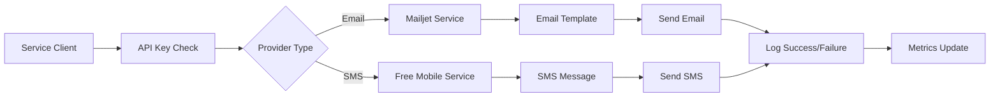

# 📧 Notification Service - ROADTRIP MVP

> **Microservice de Notifications Multi-Canal pour l'écosystème ROADTRIP**  
> *Projet M2 - MVP Microservices - Certification RNCP39583*

## 📋 Vue d'ensemble

Service Node.js gérant les **notifications emails et SMS** avec intégration Mailjet et Free Mobile, templates HTML personnalisés, sécurité API-Key et monitoring Prometheus.

### 🎯 Fonctionnalités MVP

- ✅ **Email Transactionnel** : Confirmation compte + réinitialisation mot de passe
- ✅ **SMS Free Mobile** : Codes de vérification par SMS
- ✅ **Templates HTML** : Emails branded ROADTRIP responsives
- ✅ **API Security** : Protection API-Key pour requêtes inter-services
- ✅ **Multi-Provider** : Mailjet (email) + Free Mobile (SMS)
- ✅ **Monitoring Intégré** : Métriques Prometheus + health checks
- ✅ **Fallback Mode** : Simulation si providers non configurés

---

## 🚀 Installation & Démarrage

### Prérequis
```bash
Node.js 20+
npm ou yarn
Compte Mailjet (email)
Compte Free Mobile avec API SMS (SMS)
```

### Configuration
```bash
# Cloner et installer
git clone <repo>
cd notification-service
npm install

# Configurer l'environnement
cp .env.example .env
```

### Variables d'environnement
```env
# Service Configuration
PORT=5005
NODE_ENV=development
API_KEY=your-secret-api-key-here
CORS_ORIGIN=http://localhost:3000

# Email Provider (Mailjet)
MAILJET_API_KEY=your-mailjet-api-key
MAILJET_API_SECRET=your-mailjet-secret-key
EMAIL_FROM_NAME=ROADTRIP
EMAIL_FROM_ADDRESS=noreply@roadtrip.fr

# SMS Provider (Free Mobile)
FREE_SMS_USER=your-free-mobile-username
FREE_SMS_PASS=your-free-mobile-api-key

# Frontend
FRONTEND_URL=http://localhost:3000
```

### Lancement
```bash
# Développement
npm run dev

# Production
npm start

# Tests avec coverage
npm test

# Health check
npm run health
```

---

## 📡 API Endpoints

### 📧 Notifications Email

#### Email de Confirmation
```http
POST /api/email/confirm
Content-Type: application/json
x-api-key: your-secret-api-key

{
  "email": "user@example.com",
  "token": "abc123def456"
}
```

**Template Email Confirmation :**
```html
<div style="font-family: Arial, sans-serif; max-width: 600px; margin: 0 auto;">
  <h1 style="color: #E30613;">Bienvenue sur ROADTRIP!</h1>
  <p>Cliquez sur le lien ci-dessous pour confirmer votre compte :</p>
  <a href="http://localhost:3000/confirm-account?token=abc123def456" 
     style="background: #E30613; color: white; padding: 15px 30px; 
            text-decoration: none; border-radius: 5px;">
    Confirmer mon compte
  </a>
  <p>Ce lien expire dans 24 heures.</p>
</div>
```

#### Email de Réinitialisation
```http
POST /api/email/reset
Content-Type: application/json
x-api-key: your-secret-api-key

{
  "email": "user@example.com",
  "code": "123456"
}
```

**Template Email Reset :**
```html
<div style="font-family: Arial, sans-serif; max-width: 600px; margin: 0 auto;">
  <h1 style="color: #E30613;">Réinitialisation de mot de passe</h1>
  <p>Voici votre code de réinitialisation :</p>
  <div style="background: #f5f5f5; padding: 20px; text-align: center;">
    <span style="font-size: 32px; font-weight: bold; letter-spacing: 5px; color: #E30613;">
      123456
    </span>
  </div>
  <p>Ce code expire dans 1 heure.</p>
</div>
```

### 📱 Notifications SMS

#### SMS Code de Réinitialisation
```http
POST /api/sms/reset
Content-Type: application/json
x-api-key: your-secret-api-key

{
  "username": "12345678",
  "apiKey": "your-free-mobile-api-key",
  "code": "654321"
}
```

**Réponse Success :**
```json
{
  "success": true,
  "status": 200
}
```

**Message SMS :**
```
RoadTrip! - Votre code de réinitialisation est : 654321
```

### 🔧 Système & Monitoring
```http
GET /health          # État du service + providers
GET /vitals          # Statistiques système
GET /metrics         # Métriques Prometheus
GET /ping            # Test connectivité simple
```

---

## 🏗️ Architecture

### Structure Projet
```
notification-service/
├── services/              # Services notifications
│   ├── emailService.js    # Service Mailjet
│   └── smsService.js      # Service Free Mobile
├── utils/                 # Utilitaires
│   └── logger.js         # Logger ROADTRIP
├── test/                  # Tests
│   └── notification.test.js
├── routes.js              # Routes API centralisées
├── metrics.js             # Métriques Prometheus
├── index.js               # Point d'entrée + serveur
├── package.json           # Dépendances
└── Dockerfile             # Container
```

### Flow Notifications


---

## 🔒 Sécurité & Authentification

### API Key Protection
```javascript
// Middleware sécurité inter-services
const requireApiKey = (req, res, next) => {
  const apiKey = req.headers["x-api-key"];
  if (!apiKey || apiKey !== process.env.NOTIFICATION_API_KEY) {
    return res.status(403).json({ error: "API key requise" });
  }
  next();
};

// Validation email
const validateEmail = (email) => /^[^\s@]+@[^\s@]+\.[^\s@]+$/.test(email);
```

### Configuration Providers Sécurisée
```javascript
// Email Service - Mailjet
const transporter = nodemailer.createTransporter(
  mailjetTransport({
    auth: {
      apiKey: process.env.MAILJET_API_KEY,
      apiSecret: process.env.MAILJET_API_SECRET,
    },
  })
);

// SMS Service - Free Mobile
const smsConfig = {
  baseURL: 'https://smsapi.free-mobile.fr/sendmsg',
  timeout: 10000,
  validateStatus: (status) => status === 200
};
```

### Templates Sécurisés
```javascript
// Prévention XSS dans templates
const createConfirmationEmail = (token) => {
  const sanitizedToken = token.replace(/[<>"']/g, ''); // Basic sanitization
  const link = `${process.env.FRONTEND_URL}/confirm-account?token=${sanitizedToken}`;
  
  return {
    subject: "Confirmez votre compte - ROADTRIP!",
    html: `<!-- Template HTML sécurisé -->`
  };
};
```

---

## 📊 Monitoring & Métriques

### Métriques Prometheus Spécialisées
- **Notifications** : `notification_service_emails_sent_total`
- **SMS** : `notification_service_sms_sent_total`
- **Providers** : `notification_service_external_service_health`
- **Performance** : `notification_service_http_request_duration_seconds`

### Health Check Avancé
```bash
curl http://localhost:5005/health
# {
#   "status": "healthy",
#   "service": "notification-service",
#   "providers": {
#     "mailjet": true,
#     "freeMobile": true
#   },
#   "timestamp": "2024-01-15T10:30:00.000Z"
# }
```

### Logs Structurés
```javascript
// Log email envoyé
logger.info("Email de confirmation envoyé avec succès", {
  type: "email",
  action: "confirmation", 
  email: "user@example.com",
  messageId: "msg-12345",
  provider: "mailjet"
});

// Log SMS envoyé
logger.info("SMS envoyé avec succès via Free Mobile", {
  type: "sms",
  provider: "freemobile",
  username: "12345678",
  status: 200
});
```

---

## 🧪 Tests & Qualité

### Coverage Cible MVP
```bash
npm test
# ✅ Email Service (88% coverage)
# ✅ SMS Service (85% coverage)
# ✅ API Endpoints (90% coverage) 
# ✅ Security Middleware (95% coverage)
# ✅ Error Handling (82% coverage)
```

### Tests Critiques
```javascript
describe('📧 Email Notifications', () => {
  test('Sends confirmation email with valid API key', async () => {
    const response = await request(app)
      .post('/api/email/confirm')
      .set('x-api-key', 'test-valid-key')
      .send({
        email: 'test@example.com',
        token: 'abc123'
      });
    
    expect(response.status).toBe(200);
    expect(response.body.success).toBe(true);
  });

  test('Rejects request without API key', async () => {
    const response = await request(app)
      .post('/api/email/confirm')
      .send({
        email: 'test@example.com', 
        token: 'abc123'
      });
    
    expect(response.status).toBe(403);
    expect(response.body.error).toBe('API key requise');
  });

  test('Validates email format', async () => {
    const response = await request(app)
      .post('/api/email/confirm')
      .set('x-api-key', 'test-valid-key')
      .send({
        email: 'invalid-email',
        token: 'abc123'
      });
    
    expect(response.status).toBe(400);
    expect(response.body.error).toBe('Paramètres invalides');
  });
});

describe('📱 SMS Notifications', () => {
  test('Sends SMS with Free Mobile provider', async () => {
    const response = await request(app)
      .post('/api/sms/reset')
      .set('x-api-key', 'test-valid-key')
      .send({
        username: '12345678',
        apiKey: 'test-api-key',
        code: '123456'
      });
    
    expect([200, 500]).toContain(response.status);
    if (response.status === 200) {
      expect(response.body.success).toBe(true);
    }
  });
});
```

---

## 🐳 Déploiement Docker

```dockerfile
FROM node:20-alpine
WORKDIR /app

# Installation dépendances
COPY package*.json ./
RUN npm install -g nodemon && npm install

# Code source
COPY . .

# Ports
EXPOSE 5005 9005

# Healthcheck
HEALTHCHECK --interval=30s --timeout=3s \
  CMD npm run health || exit 1

# Démarrage
CMD ["npm", "run", "dev"]
```

---

## 🔍 Validation RNCP39583

### Critères Respectés

| Critère RNCP | Implémentation | Status |
|--------------|----------------|---------|
| **C2.2.1 - Multi-Channel Architecture** | Email + SMS + templates | ✅ |
| **C2.2.2 - Tests Notification** | Jest + mocks providers >85% | ✅ |
| **C2.2.3 - Sécurité Communications** | API-Key + validation + logs | ✅ |
| **C4.1.2 - Monitoring Notifications** | Métriques envois + providers | ✅ |
| **C4.2.1 - Audit Communications** | Logs structurés + traçabilité | ✅ |
| **C4.3.2 - Templates Versioning** | HTML templates + config | ✅ |

---

## 📈 Optimisations & Limitations MVP

### ✅ Optimisations Implémentées
- **Multi-Provider Support** : Mailjet + Free Mobile avec fallback
- **Templates Responsive** : HTML emails optimisés mobile
- **API Security** : Protection API-Key pour inter-services
- **Structured Logging** : Traçabilité complète envois/échecs
- **Graceful Degradation** : Mode simulation si providers indisponibles

### ⚠️ Limitations MVP
- **Providers Limités** : Uniquement Mailjet + Free Mobile
- **Templates Statiques** : Pas de templating dynamique avancé
- **Queue System** : Envois synchrones (pas Redis Queue)
- **Retry Logic** : Pas de retry automatique sur échec

---

## 🚧 Roadmap Post-MVP

### Phase 2 (Production)
- [ ] **Queue System** : Redis Queue pour envois asynchrones
- [ ] **Retry Logic** : Retry automatique avec backoff exponentiel
- [ ] **Template Engine** : Handlebars pour templates dynamiques
- [ ] **Multi-Provider** : SendGrid, Twilio SMS backup
- [ ] **Delivery Tracking** : Webhooks de statut livraison

### Phase 3 (Enterprise)
- [ ] **Push Notifications** : Firebase Cloud Messaging
- [ ] **In-App Notifications** : WebSocket real-time
- [ ] **Advanced Templates** : A/B testing templates
- [ ] **Analytics** : Métriques ouverture/clic emails
- [ ] **Internationalization** : Templates multi-langues

---

## 🐛 Troubleshooting

### Erreurs Courantes
```bash
# Mailjet non configuré
Warning: Mailjet non configuré - les emails seront simulés
# Solution: Définir MAILJET_API_KEY + MAILJET_API_SECRET

# Free Mobile echec SMS
Error: API Free Mobile retourne: 403
# Solution: Vérifier FREE_SMS_USER + FREE_SMS_PASS + service activé

# API Key manquante
Error: API key requise
# Solution: Ajouter header x-api-key avec NOTIFICATION_API_KEY

# Template email cassé
Error: Template rendering failed
# Solution: Vérifier FRONTEND_URL pour liens de confirmation
```

### Debug Providers
```bash
# Test email confirmation
curl -X POST http://localhost:5005/api/email/confirm \
  -H "Content-Type: application/json" \
  -H "x-api-key: your-api-key" \
  -d '{"email":"test@example.com","token":"abc123"}'

# Test SMS reset
curl -X POST http://localhost:5005/api/sms/reset \
  -H "Content-Type: application/json" \
  -H "x-api-key: your-api-key" \
  -d '{"username":"12345678","apiKey":"your-key","code":"123456"}'

# Vérifier health providers
curl http://localhost:5005/health | jq '.providers'
```

### Logs Debugging
```bash
# Suivre logs en temps réel
tail -f logs/notification-service/combined.log

# Filtrer logs email
grep "type.*email" logs/notification-service/combined.log

# Filtrer logs SMS
grep "type.*sms" logs/notification-service/combined.log
```

---

## 👥 Contexte Projet

**Projet M2** - Développement d'un MVP microservices pour plateforme de roadtrip  
**Certification** : RNCP39583 - Expert en Développement Logiciel  
**Technologies** : Node.js, Mailjet, Free Mobile, Nodemailer, Express, Prometheus  
**Auteur** : Inès GERVAIS

---

## 📄 Licence

MIT License - Projet académique M2