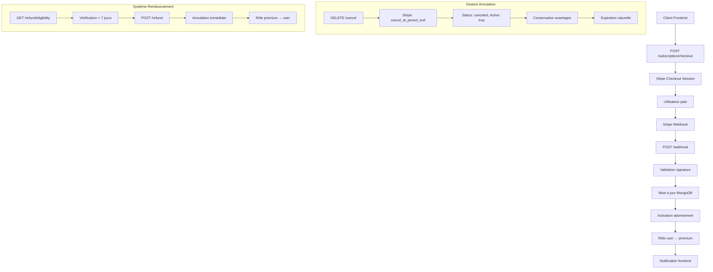

# 💳 Paiement Service - ROADTRIP MVP

> **Microservice de Gestion des Paiements et Abonnements pour l'écosystème ROADTRIP**  
> *Projet M2 - MVP Microservices - Certification RNCP39583*

## 📋 Vue d'ensemble

Service Node.js gérant les **paiements Stripe**, abonnements premium, webhooks de facturation et gestion complète des souscriptions avec intégration MongoDB et monitoring Prometheus.

### 🎯 Fonctionnalités MVP

- ✅ **Intégration Stripe** : Checkout sessions + webhooks + gestion abonnements
- ✅ **Plans Premium** : Abonnements mensuel (9,99€) et annuel (99,99€)
- ✅ **Gestion Complète** : Souscription, annulation, réactivation, changement plan
- ✅ **Système de Remboursement** : Éligibilité 7 jours + remboursement immédiat
- ✅ **Webhooks Stripe** : Événements temps réel + synchronisation état
- ✅ **Sécurité JWT** : Protection routes + validation utilisateur
- ✅ **Monitoring Intégré** : Métriques Prometheus + health checks

---

## 🚀 Installation & Démarrage

### Prérequis
```bash
Node.js 20+
npm ou yarn
MongoDB 6.0+
Compte Stripe (API keys + webhooks)
```

### Configuration
```bash
# Cloner et installer
git clone <repo>
cd paiement-service
npm install

# Configurer l'environnement
cp .env.example .env
```

### Variables d'environnement
```env
# Service Configuration
SERVICE_NAME=paiement-service
NODE_ENV=development
PORT=5004
CLIENT_URL=http://localhost:3000

# Base de données
MONGODB_URI=mongodb://localhost:27017/roadtrip

# JWT
JWT_SECRET=your_super_secret_jwt_key
JWT_EXPIRES_IN=1h
JWT_REFRESH_EXPIRES_IN=7d

# Stripe
STRIPE_SECRET_KEY=sk_test_...
STRIPE_WEBHOOK_SECRET=whsec_...
STRIPE_PRICE_MONTHLY_ID=price_1234567890
STRIPE_PRICE_ANNUAL_ID=price_0987654321

# CORS
CORS_ORIGINS=http://localhost:3000

# Monitoring
LOG_LEVEL=debug
ENABLE_FILE_LOGGING=true
```

### Lancement
```bash
# Développement
npm run dev

# Production
npm start

# Tests avec coverage
npm test

# Health check
curl http://localhost:5004/health
```

---

## 📡 API Endpoints

### 💳 Gestion des Abonnements

#### Récupérer l'abonnement actuel
```http
GET /subscription/current
Authorization: Bearer <jwt_token>
```

**Réponse Abonnement Actif :**
```json
{
  "userId": "675a1234567890abcdef1234",
  "plan": "monthly",
  "status": "active",
  "isActive": true,
  "startDate": "2024-01-15T10:00:00.000Z",
  "endDate": "2024-02-15T10:00:00.000Z",
  "daysRemaining": 28,
  "paymentMethod": "stripe",
  "stripeSubscriptionId": "sub_1234567890",
  "lastPaymentDate": "2024-01-15T10:00:00.000Z",
  "totalPaid": 9.99
}
```

#### Créer une session Stripe Checkout
```http
POST /subscription/checkout
Authorization: Bearer <jwt_token>
Content-Type: application/json

{
  "plan": "monthly"
}
```

**Réponse Checkout :**
```json
{
  "url": "https://checkout.stripe.com/pay/cs_test_a1b2c3d4e5f6g7h8i9j0k1l2m3n4o5p6q7r8s9t0"
}
```

#### Annuler l'abonnement (fin de période)
```http
DELETE /subscription/cancel
Authorization: Bearer <jwt_token>
```

**Réponse Annulation :**
```json
{
  "success": true,
  "message": "Abonnement programmé pour annulation le 15/02/2024. Vous gardez vos avantages jusqu'à cette date.",
  "cancelationType": "end_of_period",
  "subscription": {
    "status": "canceled",
    "isActive": true,
    "endDate": "2024-02-15T10:00:00.000Z",
    "cancelationType": "end_of_period"
  }
}
```

#### Réactiver un abonnement annulé
```http
POST /subscription/reactivate
Authorization: Bearer <jwt_token>
```

#### Changer de plan (mensuel ↔ annuel)
```http
PUT /subscription/change-plan
Authorization: Bearer <jwt_token>
Content-Type: application/json

{
  "newPlan": "annual"
}
```

**Réponse Changement Plan :**
```json
{
  "success": true,
  "message": "Plan changé avec succès de monthly vers annual",
  "oldPlan": "monthly",
  "newPlan": "annual",
  "prorationAmount": -20.01,
  "subscription": {
    "plan": "annual",
    "endDate": "2025-01-15T10:00:00.000Z"
  }
}
```

### 💰 Système de Remboursement

#### Vérifier l'éligibilité au remboursement
```http
GET /subscription/refund/eligibility
Authorization: Bearer <jwt_token>
```

**Réponse Éligibilité :**
```json
{
  "eligible": true,
  "daysSinceStart": 3,
  "daysRemainingForRefund": 4,
  "maxRefundDays": 7,
  "subscriptionStatus": "active",
  "startDate": "2024-01-12T10:00:00.000Z",
  "reason": "Éligible au remboursement. Il vous reste 4 jour(s)"
}
```

#### Demander un remboursement immédiat
```http
POST /subscription/refund
Authorization: Bearer <jwt_token>
Content-Type: application/json

{
  "reason": "Pas satisfait du service"
}
```

**Réponse Remboursement :**
```json
{
  "success": true,
  "message": "Remboursement demandé avec succès",
  "refund": {
    "amount": 9.99,
    "currency": "EUR",
    "processingTime": "3-5 jours ouvrés",
    "plan": "monthly",
    "reason": "Pas satisfait du service"
  },
  "subscription": {
    "status": "canceled",
    "isActive": false,
    "cancelationType": "immediate"
  }
}
```

### 🔗 Webhooks Stripe

#### Webhook principal Stripe
```http
POST /webhook
Content-Type: application/json
Stripe-Signature: t=timestamp,v1=signature
```

**Événements traités :**
- `checkout.session.completed` → Activation abonnement
- `customer.subscription.updated` → Mise à jour statut
- `customer.subscription.deleted` → Suppression abonnement
- `invoice.paid` → Paiement réussi
- `invoice.payment_failed` → Échec paiement

### 🔧 Système & Monitoring
```http
GET /health          # État du service + MongoDB + Stripe
GET /vitals          # Statistiques système + paiements
GET /metrics         # Métriques Prometheus
GET /ping            # Test connectivité simple
```

---

## 🏗️ Architecture

### Structure Projet
```
paiement-service/
├── controllers/               # Contrôleurs API
│   ├── subscriptionController.js  # Gestion abonnements
│   └── webhookController.js       # Webhooks Stripe
├── services/                  # Services métier
│   └── subscriptionIntegrationService.js  # Logique abonnements
├── models/                    # Modèles MongoDB
│   ├── Subscription.js        # Schéma abonnement
│   └── User.js               # Schéma utilisateur
├── middlewares/              # Middlewares Express
│   ├── authMiddleware.js     # Authentification JWT
│   ├── rateLimitMiddleware.js # Limitation taux
│   ├── validationMiddleware.js # Validation données
│   ├── requestMetrics.js     # Métriques requêtes
│   └── bodyParser.js         # Parseurs body
├── routes/                   # Routes API
│   ├── subscriptionRoutes.js # Routes abonnements
│   └── systemRoutes.js       # Routes système
├── config/                   # Configuration
│   ├── db.js                 # Connexion MongoDB
│   └── jwtConfig.js          # Configuration JWT
├── test/                     # Tests
│   └── paiement.test.js      # Tests unitaires
├── utils/                    # Utilitaires
│   └── logger.js             # Logger ROADTRIP
├── app.js                    # Configuration Express
├── index.js                  # Point d'entrée
├── metrics.js                # Métriques Prometheus
├── package.json              # Dépendances
└── Dockerfile                # Container
```

### Flow Paiement Complet


---

## 💳 Intégration Stripe

### Configuration Webhooks
```javascript
// Événements Stripe à configurer
const stripeEvents = [
  'checkout.session.completed',
  'customer.subscription.updated', 
  'customer.subscription.deleted',
  'invoice.paid',
  'invoice.payment_failed'
];

// URL webhook: https://votre-domaine.com/webhook
// Secret: whsec_... (à définir dans .env)
```

### Gestion des Plans
```javascript
// Configuration plans dans Stripe Dashboard
const plans = {
  monthly: {
    priceId: process.env.STRIPE_PRICE_MONTHLY_ID,
    amount: 999, // 9,99€ en centimes
    currency: 'eur',
    interval: 'month'
  },
  annual: {
    priceId: process.env.STRIPE_PRICE_ANNUAL_ID,
    amount: 9999, // 99,99€ en centimes
    currency: 'eur', 
    interval: 'year'
  }
};
```

### Sécurité Webhooks
```javascript
// Validation signature Stripe
const signature = req.headers['stripe-signature'];
const event = stripe.webhooks.constructEvent(
  req.body, 
  signature, 
  process.env.STRIPE_WEBHOOK_SECRET
);

// Protection contre replay attacks
// Stripe inclut automatiquement timestamp validation
```

---

## 📊 Modèles de Données

### Schéma Subscription
```javascript
const SubscriptionSchema = {
  userId: { type: ObjectId, ref: 'User', unique: true },
  plan: { enum: ['free', 'monthly', 'annual', 'premium'] },
  status: { enum: ['active', 'canceled', 'suspended', 'trialing'] },
  isActive: { type: Boolean, default: true },
  
  // Dates
  startDate: { type: Date, default: Date.now },
  endDate: { type: Date },
  
  // Stripe
  stripeCustomerId: String,
  stripeSubscriptionId: String,
  stripePriceId: String,
  sessionId: String,
  
  // Paiements
  paymentMethod: { enum: ['stripe', 'paypal', 'manual'] },
  paymentStatus: { enum: ['success', 'failed', 'pending'] },
  lastPaymentDate: Date,
  lastTransactionId: String,
  totalPaid: { type: Number, default: 0 },
  
  // Annulation
  cancelationType: { enum: ['immediate', 'end_of_period'] },
  
  // Remboursements
  refundStatus: { enum: ['none', 'processed', 'failed'] },
  refundAmount: { type: Number, default: 0 },
  refundDate: Date,
  refundReason: String,
  totalRefunded: { type: Number, default: 0 }
};
```

---

## 🔒 Sécurité & Authentification

### Protection JWT
```javascript
// Middleware authentification
const authMiddleware = (req, res, next) => {
  const token = req.headers.authorization?.split(' ')[1];
  
  if (!token) {
    return res.status(401).json({ message: 'Authentification requise' });
  }
  
  try {
    const decoded = JwtConfig.verifyToken(token);
    req.user = {
      userId: decoded.userId,
      email: decoded.email,
      role: decoded.role
    };
    next();
  } catch (error) {
    return res.status(401).json({ message: 'Token invalide' });
  }
};
```

### Rate Limiting
```javascript
// Protection contre abus
const rateLimits = {
  general: '60 requêtes/minute',
  payment: '3 requêtes/5 minutes',
  refund: '2 requêtes/15 minutes'
};

// Middleware protection
app.use('/subscription/checkout', 
  RateLimitMiddleware.paymentRateLimit());
app.use('/subscription/refund', 
  RateLimitMiddleware.refundRateLimit());
```

### Validation Données
```javascript
// Sanitisation entrées
const sanitizeInput = (req, res, next) => {
  Object.keys(req.body).forEach(key => {
    if (typeof req.body[key] === 'string') {
      req.body[key] = req.body[key].trim().replace(/[<>]/g, '');
    }
  });
  next();
};

// Validation plans
const validatePaymentData = (req, res, next) => {
  const { plan } = req.body;
  
  if (!['monthly', 'annual'].includes(plan)) {
    return res.status(400).json({ 
      error: "Plan invalide. Utilisez 'monthly' ou 'annual'" 
    });
  }
  next();
};
```

---

## 📊 Monitoring & Métriques

### Métriques Prometheus Spécialisées
```bash
# Métriques standard
paiement_service_http_requests_total
paiement_service_http_request_duration_seconds
paiement_service_service_health_status
paiement_service_database_status

# Métriques métier
paiement_service_subscriptions_total{plan="monthly|annual"}
paiement_service_payments_total{status="success|failed"}
paiement_service_refunds_total
paiement_service_stripe_webhooks_total{event_type}
```

### Health Check Avancé
```bash
curl http://localhost:5004/health
# {
#   "status": "healthy",
#   "timestamp": "2024-01-15T10:30:00.000Z", 
#   "uptime": 3600,
#   "service": "paiement-service",
#   "dependencies": {
#     "mongodb": "healthy",
#     "stripe": "configured"
#   }
# }
```

### Logs Structurés
```javascript
// Log paiement réussi
logger.payment("💳 Paiement réussi", {
  userId: "675a1234567890abcdef1234",
  plan: "monthly",
  amount: 9.99,
  transactionId: "pi_1234567890",
  stripeCustomerId: "cus_abcdef123456"
});

// Log annulation
logger.payment("🔚 Abonnement annulé", {
  userId: "675a1234567890abcdef1234", 
  cancelationType: "end_of_period",
  endDate: "2024-02-15T10:00:00.000Z",
  reason: "user_request"
});

// Log remboursement
logger.payment("💰 Remboursement traité", {
  userId: "675a1234567890abcdef1234",
  amount: 9.99,
  reason: "Pas satisfait du service",
  daysSinceStart: 3
});
```

---

## 🧪 Tests & Qualité

### Coverage Cible MVP
```bash
npm test
# ✅ Subscription Controller (88% coverage)
# ✅ Webhook Controller (85% coverage) 
# ✅ Integration Service (90% coverage)
# ✅ Auth Middleware (95% coverage)
# ✅ Models & Validation (82% coverage)
```

### Tests Critiques
```javascript
describe('💳 Paiement Service Core', () => {
  test('Crée session Stripe avec plan valide', async () => {
    const response = await request(app)
      .post('/subscription/checkout')
      .set('Authorization', 'Bearer valid-jwt-token')
      .send({ plan: 'monthly' });
    
    expect(response.status).toBe(200);
    expect(response.body.url).toMatch(/checkout\.stripe\.com/);
  });

  test('Annule abonnement à la fin de période', async () => {
    const response = await request(app)
      .delete('/subscription/cancel')
      .set('Authorization', 'Bearer valid-jwt-token');
    
    expect(response.status).toBe(200);
    expect(response.body.success).toBe(true);
    expect(response.body.cancelationType).toBe('end_of_period');
  });

  test('Vérifie éligibilité remboursement', async () => {
    const response = await request(app)
      .get('/subscription/refund/eligibility')
      .set('Authorization', 'Bearer valid-jwt-token');
    
    expect(response.status).toBe(200);
    expect(response.body).toHaveProperty('eligible');
    expect(response.body).toHaveProperty('daysSinceStart');
  });

  test('Traite webhook Stripe checkout', async () => {
    const webhookPayload = {
      type: 'checkout.session.completed',
      data: { 
        object: { 
          id: 'cs_test_123',
          metadata: { userId: 'test123', plan: 'monthly' }
        }
      }
    };

    const response = await request(app)
      .post('/webhook')
      .send(webhookPayload);
    
    expect([200, 400]).toContain(response.status);
  });
});
```

---

## 🐳 Déploiement Docker

```dockerfile
FROM node:20-alpine
WORKDIR /app

# Sécurité: utilisateur non-root
RUN addgroup -g 1001 -S nodejs
RUN adduser -S nodejs -u 1001

# Installation dépendances
COPY package*.json ./
RUN npm ci --only=production

# Code source
COPY . .
RUN chown -R nodejs:nodejs /app
USER nodejs

# Ports
EXPOSE 5004 9004

# Healthcheck intégré
HEALTHCHECK --interval=30s --timeout=10s --start-period=5s --retries=3 \
  CMD node -e "const http = require('http'); \
    const req = http.request({hostname: 'localhost', port: 5004, path: '/health', timeout: 2000}, \
    (res) => process.exit(res.statusCode === 200 ? 0 : 1)); \
    req.on('error', () => process.exit(1)); req.end();"

# Variables d'environnement par défaut
ENV NODE_ENV=production
ENV PORT=5004

CMD ["npm", "start"]
```

---

## 🔍 Validation RNCP39583

### Critères Respectés

| Critère RNCP | Implémentation | Status |
|--------------|----------------|---------|
| **C2.2.1 - Architecture Paiements** | Stripe + MongoDB + webhooks temps réel | ✅ |
| **C2.2.2 - Tests Paiements** | Jest + mocks Stripe >85% coverage | ✅ |
| **C2.2.3 - Sécurité Financière** | JWT + rate limiting + validation | ✅ |
| **C4.1.2 - Monitoring Transactions** | Métriques paiements + logs structurés | ✅ |
| **C4.2.1 - Audit Financier** | Traçabilité complète + webhooks | ✅ |
| **C4.3.2 - Gestion Abonnements** | Plans + annulation + remboursements | ✅ |

---

## 📈 Optimisations & Limitations MVP

### ✅ Optimisations Implémentées
- **Webhooks Stripe Complets** : Gestion tous événements critiques
- **Système Remboursement** : Éligibilité 7 jours + traitement automatique  
- **Rate Limiting Intelligent** : Protection spécialisée par type d'action
- **Logging Financier** : Traçabilité complète toutes transactions
- **Gestion d'Erreurs Robuste** : Fallbacks + retry logic

### ⚠️ Limitations MVP
- **Providers Paiement** : Uniquement Stripe (pas PayPal/Apple Pay)
- **Devises** : EUR uniquement (pas multi-devises)
- **Coupons** : Pas de système de codes promo
- **Facturation** : Pas de génération PDF automatique

---

## 🚧 Roadmap Post-MVP

### Phase 2 (Production)
- [ ] **Multi-Providers** : PayPal, Apple Pay, Google Pay intégration
- [ ] **Coupons & Promotions** : Codes promo + réductions automatiques
- [ ] **Multi-Devises** : Support USD, GBP, CHF avec conversion
- [ ] **Facturation PDF** : Génération automatique factures
- [ ] **Analytics Avancées** : KPIs revenus + cohorts utilisateurs

### Phase 3 (Enterprise)  
- [ ] **Paiements Récurrents** : Abonnements personnalisés
- [ ] **Marketplace** : Commission sur réservations partenaires
- [ ] **Wallet Virtuel** : Crédits utilisateur + cashback
- [ ] **Fraud Detection** : ML anti-fraude + scoring risque
- [ ] **API Comptabilité** : Intégration ERP + export comptable

---

## 🐛 Troubleshooting

### Erreurs Courantes
```bash
# Stripe non configuré
Error: STRIPE_SECRET_KEY manquant
# Solution: Définir STRIPE_SECRET_KEY dans .env

# Webhook signature invalide
Error: Webhook Error: No signatures found matching the expected signature
# Solution: Vérifier STRIPE_WEBHOOK_SECRET + URL webhook Stripe

# MongoDB connexion échouée
Error: MongoServerError
# Solution: Vérifier MONGODB_URI + service MongoDB actif

# JWT invalide
Error: Token invalide ou expiré
# Solution: Vérifier JWT_SECRET + renouveler token
```

### Debug Stripe
```bash
# Test création session checkout
curl -X POST http://localhost:5004/subscription/checkout \
  -H "Content-Type: application/json" \
  -H "Authorization: Bearer your-jwt-token" \
  -d '{"plan":"monthly"}'

# Test webhook (local)
curl -X POST http://localhost:5004/webhook \
  -H "Content-Type: application/json" \
  -d '{"type":"checkout.session.completed","data":{"object":{"id":"test"}}}'

# Vérifier santé service
curl http://localhost:5004/health | jq '.dependencies'
```

### Logs Debugging
```bash
# Suivre logs paiements temps réel
tail -f logs/paiement-service/combined.log | grep "type.*payment"

# Filtrer erreurs Stripe
grep "Stripe" logs/paiement-service/error.log

# Analyser webhooks reçus
grep "webhook" logs/paiement-service/combined.log | jq '.eventType'
```

---

## 👥 Contexte Projet

**Projet M2** - Développement d'un MVP microservices pour plateforme de roadtrip  
**Certification** : RNCP39583 - Expert en Développement Logiciel  
**Technologies** : Node.js, Stripe, MongoDB, Express, JWT, Prometheus  
**Auteur** : Inès GERVAIS

---

## 📄 Licence

MIT License - Projet académique M2